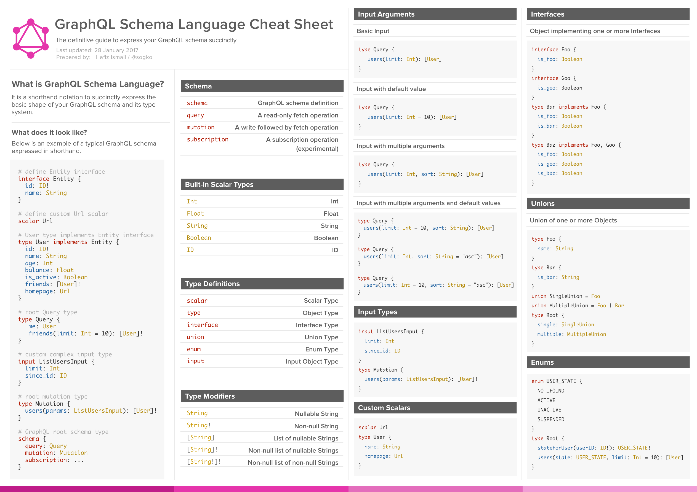

## Table of Contents

1. [What is GraphQL?](#what-is-graphql)
2. [How does GraphQL work?](#how-does-graphql-work)  
3. [How can one use GraphQL?](#how-can-one-use-graphql)
4. [Working with GraphQL and NodeJS](#working-with-graphql-and-nodejs)
5. [References](#references)  


Because of the limited time I am just able to tell you about the standard and basic patterns of GraphQL.  
For further reading please visit: [GraphQL-Homepage](http://graphql.org/learn)

## What is GraphQL?

GraphQL is:  
- a possibility to describe your api's data and to provide actions on them over HTTP
- an alternative to REST (Representational State Transfer)
- a query language and server-side-runtime
- not tied to any specific database or storage engine
- developed internally by [Facebook Inc.](https://investor.fb.com/home/default.aspx)

## How does GraphQL work?

- Clients send GraphQL-Queries as HTTP-Requests to a GraphQL-Service to perform actions
- These GraphQL-Queries are formed in the GraphQL-Syntax
- The server then validates, parses and executes them and returns the result
- The Queries which can be executed by the GraphQL-Service are defined by the Service

### The GraphQL-Syntax

  
### Defining a GraphQL-Service
The main parts of every GraphQL-Service are:
   - the Schema
   - the Resolvers  

#### The GraphQL-Schema
The Schema of a GraphQL-Service defines which queries are allowed, what types of data can be fetched 
and what the relationships between these types are. It is defined using either the GraphQL-Syntax or
a programming language specific pattern. When using the GraphQL-Syntax to define the schema it is easier
to reuse it, or to change the programming language later.  

An example schema is:
```
type Author {
   id: ID!
   name: String!
   email: String
}

type Post {
   id: ID!
   title: String!
   description: String
   text: String!
   authors: [Author!]!
}

input AuthorInput {
    name: String!
    email: String
}

input PostInput {
   title: String!
   description: String
   text: String!
   authors: [ID!]!
}

type Query {
   getAuthor(name: String!): [Author!]
   getPost(title: String!): [Post!]
}

type Mutation {
    insertAuthor(author: AuthorInput!): Author
    insertPost(post: PostInput!): Post
}

schema {
   query: Query
   mutation: Mutation
}

```

### The Resolvers
The Resolvers specify how the various types and their fields are connected to (various) backends.
These Resolvers can interact with any kind of backend/database/storage engine to access the data.
Because they are mostly represented by functions they are GraphQL-Implementation and programming
language specific.  

Example Resolvers (in pseudo code): 
```javascript
//This function would interact with a possible SQL-Database and answer with a Promise
async function (parent, { name }, context) => {
    return context.sql.exec('SELECT * FROM authors WHERE name = %s', name);
}

//This function would call a REST-Service to receive the queried data
function (parent, { name }, context) => {
    return request('https://api.blog.io/by_author/${name}');
}
```

### The Query
The Query is formed based on the GraphQL-Schema of the queried Service and the GraphQL-Syntax. One 
HTTP-Request can contain as many queries as needed and wanted. Also the data which is returned can
be specified by the query by querying just specific fields of a type. How the queries are passed over 
HTTP can be chosen freely. The standard way is to pass them as parameter `query` in GET-Request and
as `body` in POST-Request. When a query contains inputs it is often useful to separate the actual query
from the inputs. Therefore GraphQL has such a built-in pattern which allows to pass the variables separately as `JSON-Object` (See examples below).   

Example Queries:
```
//This query would execute the getAuthor-function of the Service and would return an author
query getAuthor {
    getAuthor(name: "Donald Trump") {
        id
        name
        email
    }
}

//This query is the same as above, but this time we just want the id of the author
query getAuthor {
    getAuthor(name: "Donald Trump") {
        id
    }
}

//The same works using mutations
mutation insertAuthor {
    insertAuthor(author: { name: "Donald Trump", email: "donald@whitehouse.gov" }) {
        id
    }
}
```
Example Result:
```json
{
  "getAuthor": [
    {
      "id": "IAmNumberOne",
      "name": "Donald Trump",
      "email": "donald@whitehouse.gov"
    }
  ]
}
```
Variables example:
```
//This query declares the variable name and type at the top
query getAuthor($name: String) {
    getAuthor(name: $name) {
        id
        name
        email
    }
}

//The variables are then passed separately as JSON
{
    "name": "Donald Trump"
}
```
Example Requests:
```
GET /path/to/your/api?query={{ your query }}&variables={{ your variables }}

POST /path/to/your/api
{
    "query": "{{ your query as string }}",
    "variables": {{ your variables as JSON-Object }}
}
```

## How can one use GraphQL?
### GraphQL Server Libraries

There are a lot of implementations for many different programming languages.  
Among them are some for:
- Java
- JavaScript
- Go
- Scala
- C# / .NET
- Python
- ...  

A list of the implementations can be found [here](http://graphql.org/code).

### GraphQL Client Libraries
There are a lot of implementations for many different scenarios and programming languages.  
Among them are some for:
- Java / Android
- Swift / Objective-C iOS
- Go
- C# / .NET
- Python
- ...  

A list of the implementations can be found [here](http://graphql.org/learn).

## Working with GraphQL and NodeJS

1. Please visist: https://launchpad.graphql.com/new
2. Copy the code from [this script](./tutorial-script.js) to the launchpad
3. You're ready to go

## References
- http://graphql.org/learn/
- https://dev-blog.apollodata.com/graphql-explained-5844742f195e
